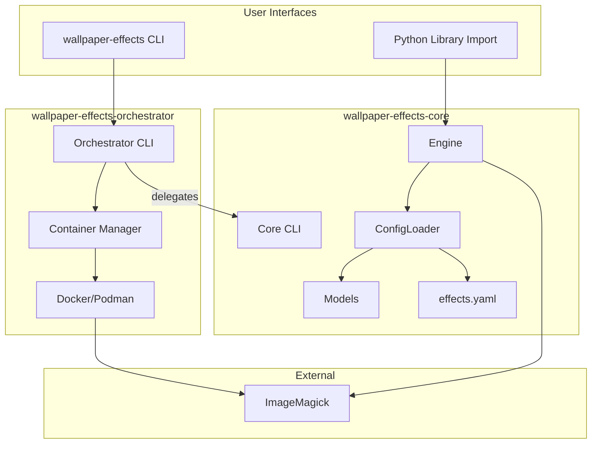
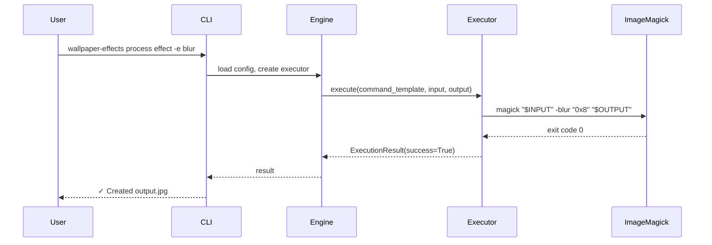
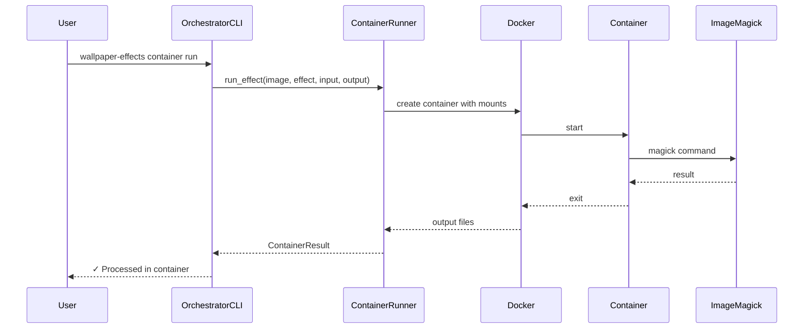
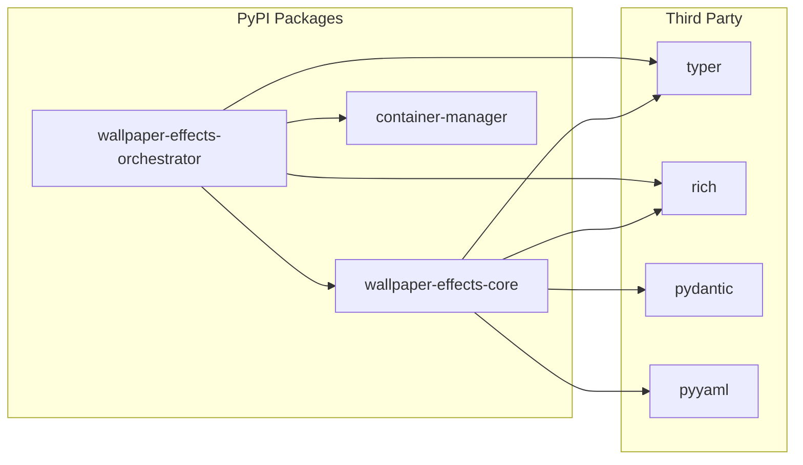

# Architecture Document: Wallpaper Effects Generator

## System Overview

The wallpaper-effects system provides ImageMagick-based image effect processing through two packages:

1. **Core** (`wallpaper-effects-core`): Standalone effect processing library and CLI
2. **Orchestrator** (`wallpaper-effects-orchestrator`): Container-based execution layer



---

## Package Architecture

### Package Relationship

```
┌─────────────────────────────────────────────────┐
│           wallpaper-effects-orchestrator        │
│                                                 │
│  ┌─────────────┐  ┌────────────────────────┐   │
│  │ container/  │  │        cli/            │   │
│  │  - runner   │  │  - main (delegates)    │   │
│  │  - image    │  │  - container cmds      │   │
│  │  - dockerfile│ │                        │   │
│  └─────────────┘  └────────────────────────┘   │
│                            │                    │
│           depends on       │                    │
└────────────────────────────┼────────────────────┘
                             │
                             ▼
┌─────────────────────────────────────────────────┐
│              wallpaper-effects-core             │
│                                                 │
│  ┌──────────┐  ┌──────────┐  ┌──────────────┐  │
│  │ models/  │  │ loader/  │  │   engine/    │  │
│  │          │  │          │  │              │  │
│  │ effects  │  │ config   │  │ executor     │  │
│  │ settings │  │ paths    │  │ chain        │  │
│  │ config   │  │          │  │ batch        │  │
│  └──────────┘  └──────────┘  └──────────────┘  │
│                                                 │
│  ┌──────────┐  ┌──────────┐  ┌──────────────┐  │
│  │ console/ │  │  cli/    │  │    data/     │  │
│  │          │  │          │  │              │  │
│  │ output   │  │ main     │  │ effects.yaml │  │
│  │ progress │  │ process  │  │              │  │
│  │          │  │ batch    │  │              │  │
│  │          │  │ show     │  │              │  │
│  └──────────┘  └──────────┘  └──────────────┘  │
│                                                 │
└─────────────────────────────────────────────────┘
```

---

## Component Descriptions

### Core Package Components

| Component | Purpose | Key Classes/Functions |
|-----------|---------|----------------------|
| `models/` | Pydantic data models | `EffectDefinition`, `Settings`, `EffectsConfig` |
| `loader/` | Configuration loading | `ConfigLoader`, path utilities |
| `engine/` | Effect execution | `CommandExecutor`, `ChainExecutor`, `BatchGenerator` |
| `console/` | Rich output | `RichOutput`, `BatchProgress` |
| `cli/` | Typer commands | `process_app`, `batch_app`, `show_app` |
| `data/` | Bundled assets | `effects.yaml` |

### Orchestrator Package Components

| Component | Purpose | Key Classes/Functions |
|-----------|---------|----------------------|
| `container/` | Container management | `ContainerRunner`, `ImageBuilder` |
| `cli/` | Extended CLI | `main`, `container_app` |

---

## Data Flow

### Effect Processing (Core)



### Container Processing (Orchestrator)



---

## CLI Delegation Pattern

When orchestrator is installed, it takes over the `wallpaper-effects` CLI:

```python
# Orchestrator's main.py
from wallpaper_effects.cli.main import process_app, batch_app, show_app

app = typer.Typer(name="wallpaper-effects")

# Re-register core's commands (DELEGATION)
app.add_typer(process_app, name="process")
app.add_typer(batch_app, name="batch")
app.add_typer(show_app, name="show")

# Add orchestrator's own commands
app.add_typer(container_app, name="container")
```

**Result**: Users get core functionality + container commands transparently.

---

## Directory Structure

```
wallpaper-effects-generator/
├── packages/
│   ├── core/
│   │   ├── pyproject.toml
│   │   ├── README.md
│   │   ├── tests/
│   │   └── src/wallpaper_effects/
│   │       ├── __init__.py
│   │       ├── _version.py
│   │       ├── data/
│   │       │   └── effects.yaml
│   │       ├── models/
│   │       │   ├── __init__.py
│   │       │   ├── effects.py
│   │       │   ├── config.py
│   │       │   └── settings.py
│   │       ├── loader/
│   │       │   ├── __init__.py
│   │       │   ├── config_loader.py
│   │       │   └── paths.py
│   │       ├── engine/
│   │       │   ├── __init__.py
│   │       │   ├── executor.py
│   │       │   ├── chain.py
│   │       │   └── batch.py
│   │       ├── console/
│   │       │   ├── __init__.py
│   │       │   ├── output.py
│   │       │   └── progress.py
│   │       └── cli/
│   │           ├── __init__.py
│   │           ├── main.py
│   │           ├── process.py
│   │           ├── batch.py
│   │           └── show.py
│   │
│   └── orchestrator/
│       ├── pyproject.toml
│       ├── README.md
│       ├── tests/
│       └── src/wallpaper_effects_orchestrator/
│           ├── __init__.py
│           ├── _version.py
│           ├── container/
│           │   ├── __init__.py
│           │   ├── dockerfile.py
│           │   ├── image.py
│           │   └── runner.py
│           └── cli/
│               ├── __init__.py
│               ├── main.py
│               └── container.py
│
├── Makefile
└── README.md
```

---

## Dependency Graph



---

## Container Image Architecture

```dockerfile
FROM alpine:3.19

# ImageMagick 7 with all required features
RUN apk add --no-cache imagemagick

WORKDIR /workspace

# Verification
RUN magick --version
```

**Image size**: ~50MB
**Features included**: All standard ImageMagick 7 operations
